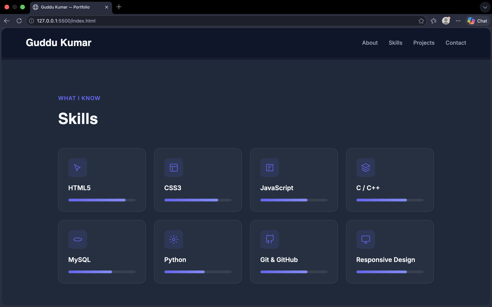
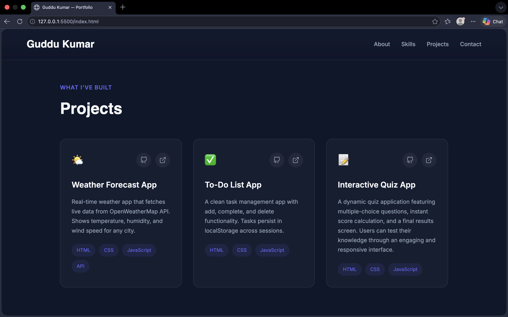

# 🌐 ABC Portfolio Website

A modern and responsive personal portfolio website built using **HTML5**, **CSS3**, and **JavaScript**. This portfolio showcases my skills, projects, and contact information in a clean and professional layout.

---

## 📌 Project Overview

This project was created to build an online presence and demonstrate my front-end web development skills. The website includes sections such as:

- 👋 Hero Section
- 🙋 About Me
- 🛠️ Skills
- 💼 Projects
- 📞 Contact Information
- 📱 Responsive Navigation

---

## ✨ Features

- ✅ Fully responsive design
- ✅ Modern and clean user interface
- ✅ Smooth scrolling navigation
- ✅ Animated hero section
- ✅ Skills showcase section
- ✅ Project cards with descriptions
- ✅ Simple contact section
- ✅ Mobile-friendly layout

---

# 🛠️ Technologies Used

| Technology | Purpose |
|-----------|----------|
| **HTML5** | Structure of the website |
| **CSS3** | Styling and responsiveness |
| **JavaScript** | Interactive functionality |
| **Google Fonts** | Typography enhancement |

---

# 📂 Project Structure

```text
portfolio-project/
│
├── index.html
├── style.css
├── README.md
│
└── screenshots/
    ├── home-page.png
    ├── skills-section.png
    └── projects-section.png
```

---

# 📸 Screenshots

Add screenshots of your website inside the **screenshots** folder and display them here.

## Home Page

```md

```

## Skills Section

```md

```

## Projects Section

```md

```

---

# 🚀 Getting Started

## 1. Clone the Repository

```bash
git clone https://github.com/your-username/your-repository-name.git
```

---

## 2. Open the Project

Navigate to the project folder:

```bash
cd your-repository-name
```

---

## 3. Run the Project

Simply open the `index.html` file in your browser.

```text
No installation or additional dependencies are required.
```

---

# 💼 Projects Included

## 🌤️ Weather Forecast App

- Displays real-time weather information.
- Uses API integration to fetch weather data.
- Shows temperature, humidity, and wind speed.

### Technologies Used:

- HTML
- CSS
- JavaScript
- API Integration

---

## ✅ To-Do List App

- Add new tasks.
- Mark tasks as completed.
- Delete tasks.
- Data persistence using local storage.

### Technologies Used:

- HTML
- CSS
- JavaScript

---

## 🧠 Interactive Quiz App

- Multiple-choice questions.
- Instant score calculation.
- User-friendly interface.
- Interactive experience.

### Technologies Used:

- HTML
- CSS
- JavaScript

---

# 🎯 Purpose of This Project

The purpose of this project is to:

- Practice front-end development skills.
- Build a professional portfolio.
- Showcase projects and technical abilities.
- Create an online profile for internship opportunities.

---

# 🔮 Future Improvements

- [ ] Add dark mode support.
- [ ] Integrate a working contact form.
- [ ] Add project filtering functionality.
- [ ] Deploy the website online.
- [ ] Include more projects and achievements.

---

# 🤝 Contributions

Suggestions and feedback are always welcome.

If you would like to improve this project, feel free to fork the repository and create a pull request.

---

# 📄 License

This project is created for **educational and portfolio purposes**.

You are free to use and modify the code for learning purposes.

---

# 👨‍💻 Author

**Name:** GUDDU KUMAR  
**Internship ID:** CTTS108

---